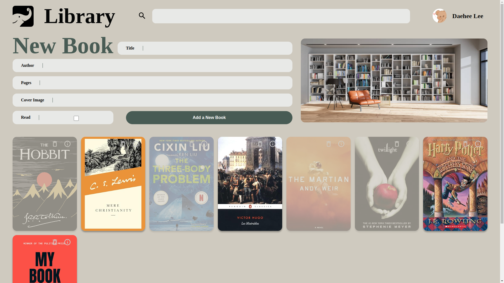
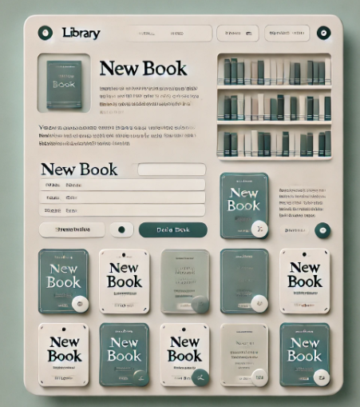

# odin-js-library
### Time Taken: 10-hr approx. 

Part of The Odin Project dummy project. Here is the [link](https://www.theodinproject.com/lessons/node-path-javascript-library) to TOP project description.

### [Live-Preview](https://leedae308.github.io/odin-js-library/)
Here is the screenshot of working website:
<figure>
    
    <figcaption>Daehee's Library Example</figcaption>
</figure>

<figure>
    
    <figcaption>Chat-GPT generated Design</figcaption>
</figure>

Based on the web-design plan above, generated by Chat-GPT, <strong>HTML, CSS, JS</strong> based custom project.

100% written codes. 

### Functionalities:
#### Adding Books; Deleting Books; Information; Read/Unread; Web-based cover-image;

### Skill Tools Used: 
CSS:  General css, grid, web-fonts; 
JS: DOM, Object Oriented Programming; 
HTML: emmet; 
